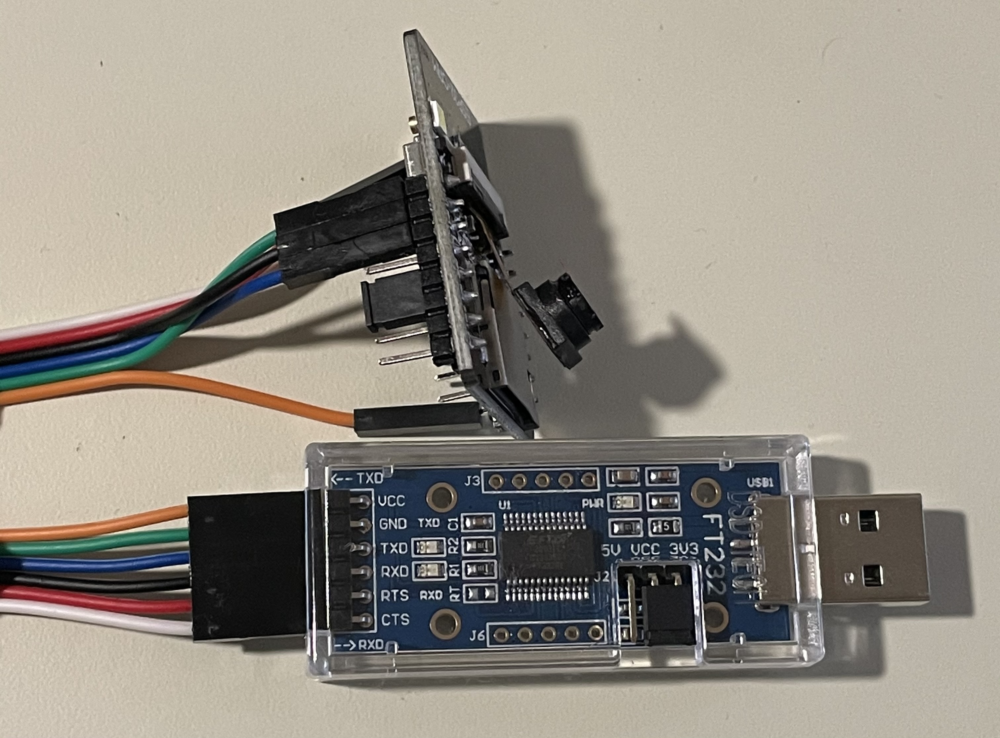
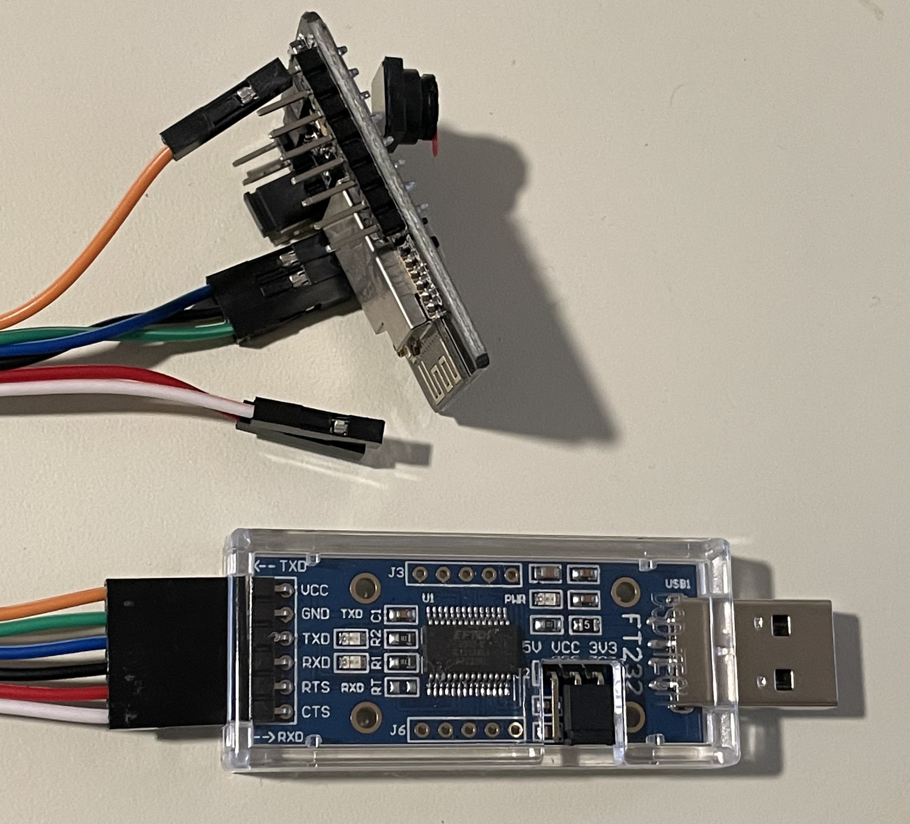
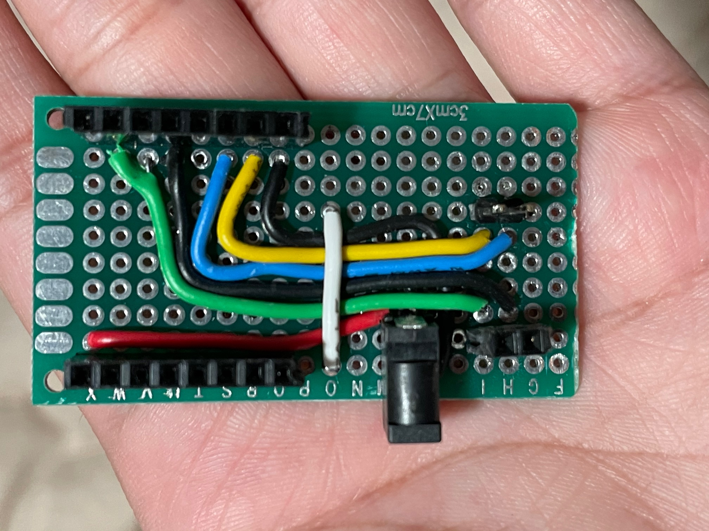
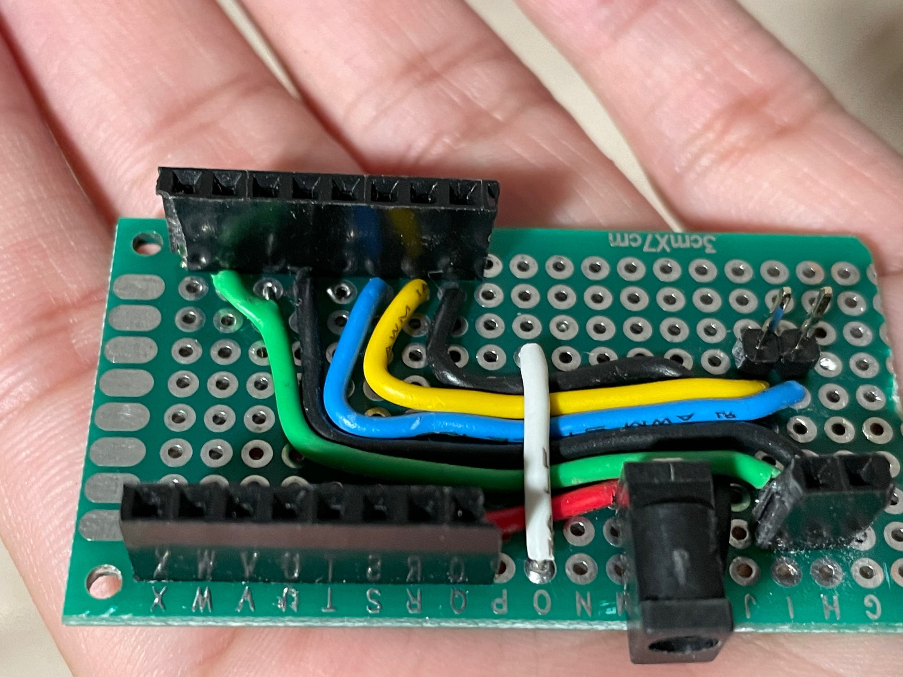
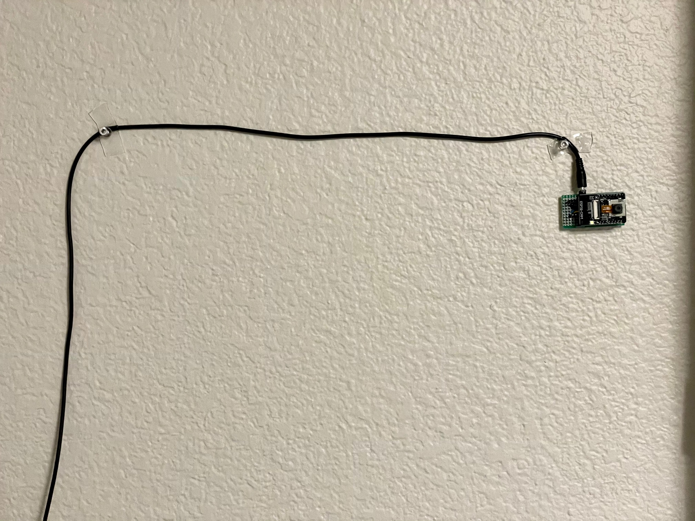

# Tiny Perception  

This repo is about building a tiny perception system which is able to do object detection as well as facial recognition. Multiple camera system is built for extremely low cost (`~ $9`) which broadcasts over wifi. Another PC with a GPU is used in a backend which grabs these streams from multiple camera systems and runs perception pipeline on those frames. 

 

## Setting up and flashing ESP32-CAM  

 - Download Arduino IDE from here: `https://www.arduino.cc/en/software`.  
 - Setup ESP32 board manager in Arduino IDE by going into `File->Preference` and typing `https://raw.githubusercontent.com/espressif/arduino-esp32/gh-pages/package_esp32_index.json` into the `Additional Board Manager URL's` field.  
 - Install ESP32 board manager in Arduino IDE by going into `Tools->Board->Boards Manager`, searching for `ESP32` and installing it.  
 - Connect the USB-to-Serial adapter with ESP32-CAM module as following:  
 ```
    FTDI VCC (+5V) -> ESP32-CAM VCC  
    FTDI GND -> ESP32-CAM GND
    FTDI TXD -> ESP32-CAM U0R
    FTDI RXD -> ESP32-CAM U0T
    FTDI IO0 -> FTDI GND (shorted using a jumper cable)
 ```  
   
     
 - Install pyserial as `pip install pyserial`.  
 - Set the interface accessible. `sudo chmod a+rw /dev/ttyUSB0`.  
 - Select `Tools->Board->ESP32 Arduino->AI Thinker ESP32-CAM`.  
 - Select appropriate port e.g. `Tools->Port->/dev/ttyUSB0`.  
 - Press the reset button to put ESP32-CAM board in flash mode.  
 - Open the project at `esp32/CameraWebServer` and click on upload.  
 - Once uploaded, remove the jumper cable.    
 - Open `Serial Monitor` and press the reset button, you should expect to see a message which looks like this.  
 ```
 WiFi connected
 Starting web server on port: '80'
 Starting stream server on port: '81'
 Camera Ready! Use 'http://10.0.0.250' to connect
 ```  
 - This stream can be accessed at `http://10.0.0.250:81/stream`.  

## Carrier Board  

A carrier board can be built for the ESP32-CAM module for easier access and power inlet as shown in the figure below:  

  
  

The female headers on the left provides `RX` and `TX` connection to the USB-to-Serial adapter, and male headers on the right is used during the `flash` mode by shorting them using a jumper cable. Power can be provided using a USB to 1.35mm barrel connector.    



## Perception Pipeline  

The perception pipeline grabs frame from these cameras over wifi in a multi-thread process, performs object detection, and if a person is found then it performs facial recognition.  

This pipeline uses [`DETR`](https://github.com/towardsautonomy/DETR) for object detection, [`dlib`](https://pypi.org/project/dlib/) for face detection, and [`face_recognition`](https://pypi.org/project/face-recognition/) for facial keypoint extraction.  

Conda environment can be installed as ```conda env create -f conda_env.yml```

### Required Hardwares  

 - ESP32-Cam module. Amazon: https://www.amazon.com/ESP32-CAM-Bluetooth-Camera-Module-Development/dp/B07S5PVZKV
 - USB to TTL Serial Adapter with FTDI chip. Amazon: https://www.amazon.com/gp/product/B07BBPX8B8  
 - USB to 1.35mm Barrel Connector. Amazon: https://www.amazon.com/gp/product/B073TY3263